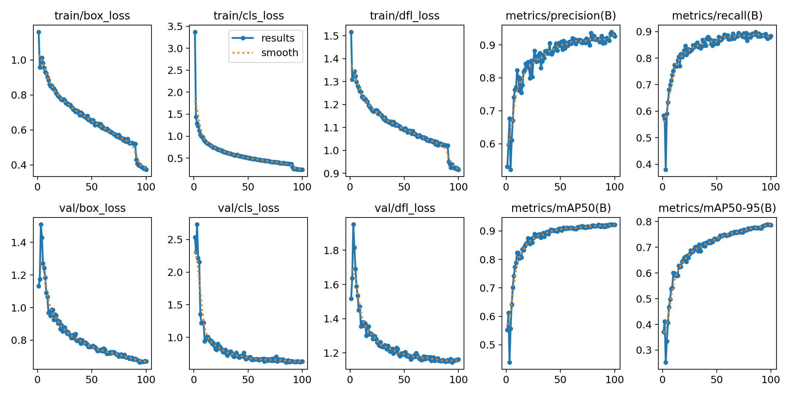
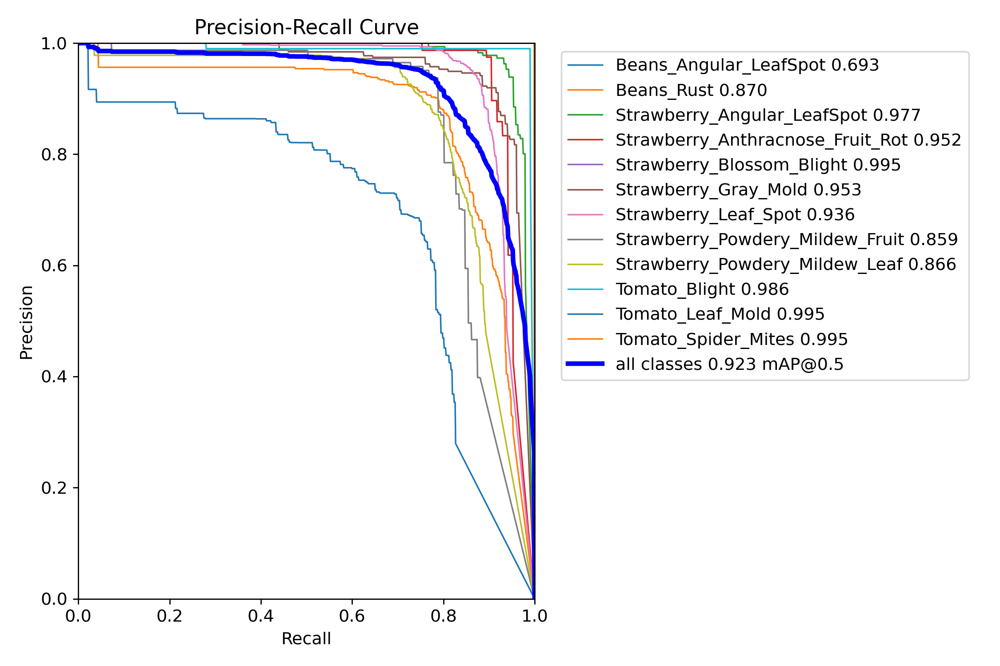
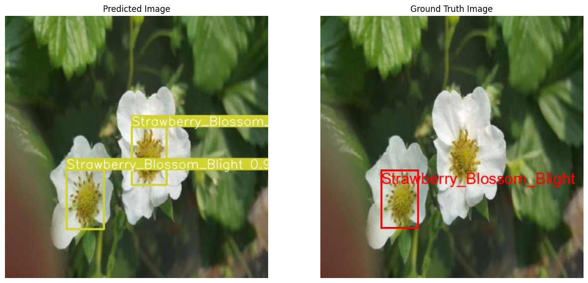
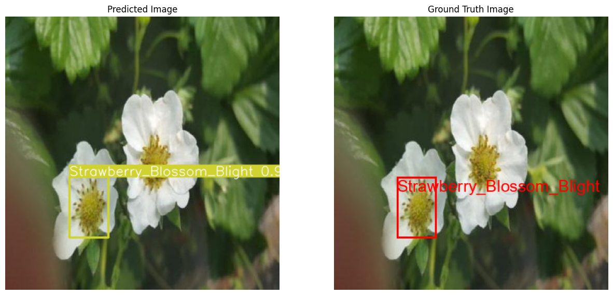

# Leaf Disease Detection using YOLOv8

## Introduction

Leaf diseases pose significant threats to agricultural productivity and food security. This project aims to identify various leaf diseases using an object detection approach with the YOLOv8n model.

## Dataset

The dataset was sourced from [Roboflow Universe](https://universe.roboflow.com/artificial-intelligence-82oex/detecting-diseases), containing images labeled with multiple leaf diseases. The dataset was pre-split into training and validation sets.

## Model Overview

We utilized the YOLOv8n model, a state-of-the-art object detection model with approximately 3.2 million parameters. Initially, YOLOv9 was considered, but due to training bugs, we switched to YOLOv8n.

## Implementation Steps

1. **Data Preparation**:
   - Data augmentation was performed using YOLOv8's default settings, including mosaic augmentation, random scaling, and color jittering.

2. **Model Training**:
   - **First Experiment**: Trained for 70 epochs without class weights.
   - **Second Experiment**: Trained for 100 epochs with class weights based on class imbalance.

3. **Evaluation**:
   - Model performance was evaluated using precision, recall, mAP@50, and mAP@50-95.
   - Example images with ground truth and predicted bounding boxes were generated.

## Results

- **First Experiment**:
  - mAP@50: 0.917
  - mAP@50-95: 0.78
- **Second Experiment**:
  - mAP@50: 0.923
  - mAP@50-95: 0.79

The second experiment showed improved metrics, demonstrating better overall model reliability and robustness.

## Example Predictions

**Experiment 1:**

**Experiment 2:**

## Challenges Faced

Class imbalance led to higher false positives and false negatives for underrepresented classes. This was mitigated by applying class weights during training. An initial attempt to use YOLOv9 faced training bugs, necessitating a switch to YOLOv8n.

## Conclusions and Potential Improvements

The YOLOv8n model demonstrated robust performance in detecting various leaf diseases. Future work will explore using YOLOv9 and YOLOv10, enhancing the dataset, and fine-tuning hyperparameters.

## Acknowledgments

We acknowledge the use of the YOLOv8 model and the dataset from [Roboflow Universe](https://universe.roboflow.com/).
